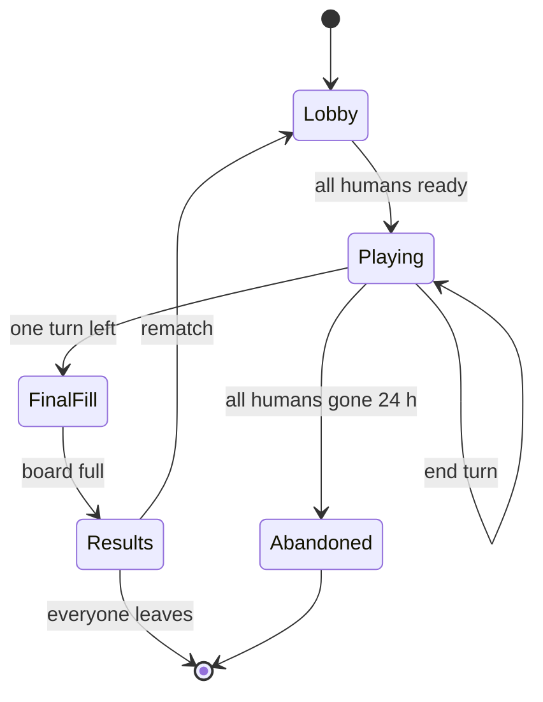
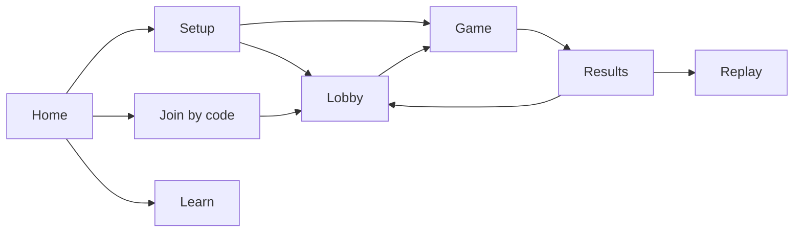
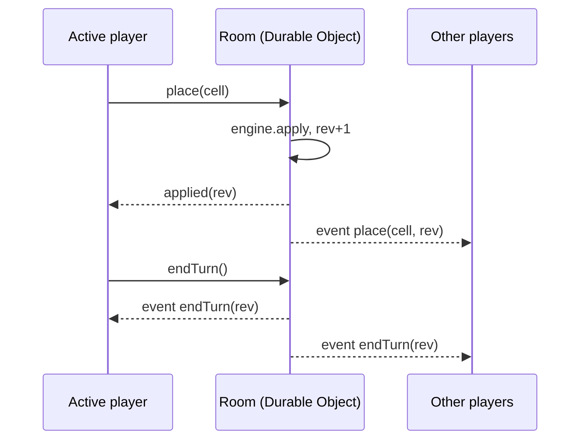

# Super Tic-Tac-Toe — Game Design Document

Sep 23, 2026 · Mike Peiman · Exported from the [living doc](https://claude.ai/code/artifact/d72fe939-63a3-4f00-91dd-cd0cb7417f1a) at revision 14.

## 1. Overview

Super Tic-Tac-Toe (STTT) is tic-tac-toe grown into a strategy game for 2–8 players. It is played online by default, on a board of any size, with several marks placed per turn. The board always fills completely, and players score for every run of marks in a row and every line they own outright.

### Pitch

Everyone knows tic-tac-toe, and everyone knows it is solved. STTT keeps the familiar gesture of placing a mark in a square and throws away the thing that makes the original dull: the single winning line. Nobody wins by getting three in a row first. Instead the board fills up, every run of three (or four, or five) scores, and the player with the densest, best-shaped territory wins.

### Design pillars

1. **Instantly familiar, deep with time.** A new player understands the board in seconds. The depth comes from moves per turn, board shape and the tension between lines and blocks, not from extra rules.
2. **Fair by construction.** Every configuration the game allows gives every player exactly the same number of moves. The setup screens only offer fair options.
3. **The computer does the counting.** Tallying runs on a 14×8 board by hand is tedious and error-prone. The app scores exactly and shows where the points came from.
4. **Online first, together always.** Online play with friends is the core mode. The game must also work on one shared screen, and alone against a bot.
5. **Warm and playful.** Emoji marks, bold player colours and small celebrations. It should feel like a family game night, not a chess clock.

### Audience

- **Primary:** friends and families who play casual games together, including a parent and child. Ages 8 and up.
- **Secondary:** abstract-strategy fans who want a configurable game with real depth.
- **Platforms:** modern desktop and mobile browsers, installable as a PWA. Touch and mouse are both first-class.

### Glossary

| Term | Meaning |
| --- | --- |
| Cell | One square of the board. |
| Mark | A player's emoji placed in a cell. |
| Move | Placing one mark. |
| Turn | One player's consecutive moves, `movesPerTurn` of them. |
| Round | Every player taking one turn. |
| N (cells to score) | The run length that earns the first point. |
| Run | Consecutive cells in one line, all owned by one player. |
| Line | A full row, column or diagonal, edge to edge. |
| Line bonus | Extra points for owning every cell of a long enough line. |
| Direction | One of the four line orientations: horizontal, vertical, diagonal down-right, diagonal down-left. |
| Locked | A mark from a finished turn. It can never be removed. |
| Pending | A mark placed this turn that can still be taken back. |

## 2. Core rules

Players take turns placing a fixed number of marks anywhere on a rectangular board until every cell is filled; then the board is scored. There is no early win and no capturing.

### Components

- **Board:** R rows × C columns, from 3×3 up to 30×30 (900 cells). Rectangular boards are normal, not a special case.
- **Players:** 2–8. Each has a name, an emoji mark and a colour. Marks and colours are unique within a game.
- **Parameters**, fixed when the game starts:

| Parameter | Range | Default |
| --- | --- | --- |
| Players | 2–8 | 2 |
| Rows × columns | 3–30 each | 8 × 12 |
| Moves per turn | 1 to cells ÷ players | 4 |
| Rounds | derived: cells ÷ (players × moves per turn) | 12 |
| Cells to score (N) | 2 to the longer board side | 3 |
| Line bonus | 0–100 points | 12 |

Every configuration must satisfy the fairness equation in section 4.

### Turn order

1. Seat order is set in the lobby. By default the host shuffles it once before the game starts; the order is then fixed for the whole game.
2. On their turn, the active player places `movesPerTurn` marks, one per empty cell, anywhere on the board. The marks need not be adjacent or in a line.
3. While the turn is open, the player can tap one of their pending marks to take it back and place it elsewhere. Locked marks from earlier turns can never be removed.
4. When all moves are placed, the player confirms with **End turn**. Every pending mark locks and play passes to the next seat.
5. A room setting, **Auto-end turn**, skips the confirmation and ends the turn on the last placement. This is the original app's behaviour.

### Final turn

Because of the fairness equation, when one turn remains the empty cells are exactly the last player's moves. The game fills them automatically with a short cascading animation, then goes straight to scoring. This "forced final turn" is a signature moment, not a shortcut.

### Game end

The game ends when the board is full. Scores are tallied (section 3) and the results screen reveals them direction by direction. Highest total wins; tie-breaks are in section 3.

### Roster changes

- Players cannot be added or removed once the first mark is placed. The move count per player would no longer be equal.
- Before the first move, the host can change seats freely. The fair options are recomputed live.
- If an online player leaves mid-game, a bot takes their seat so the board still fills fairly (section 6). Their points still count under their name with a "bot finished" marker.

### Optional turn timer

Online rooms can set a per-turn timer: off, 30 s, 60 s or 2 min. When it runs out, the remaining moves of that turn are placed at random empty cells and the turn ends. The timer is off by default and always off in local play.

## 3. Scoring

A player's score is the sum of run points and line bonuses across all four directions. Every cell takes part in four lines at once: one horizontal, one vertical and two diagonal.

### Lines

On an R×C board the game scores R horizontal lines, C vertical lines and R+C−1 lines in each diagonal direction. Diagonal lines near the corners are short; a corner diagonal is a single cell.

### Run points

Walk each line from end to end. An unbroken run of k marks by one player, where k ≥ N, scores k − N + 1 points: one point for every window of N cells that fits inside the run.

```latex
\text{runPoints}(k) = \max(0,\; k - N + 1)
```

| Run length k (N = 3) | Points |
| --- | --- |
| 1–2 | 0 |
| 3 | 1 |
| 4 | 2 |
| 5 | 3 |
| 14 | 12 |

Example, one 14-cell row with N = 3: `A A A A A B A A A B A A B B`. Player A has runs of 5, 3 and 2 for 3 + 1 + 0 = 4 points. Player B has runs of 1, 1 and 2 for 0 points.

### Line bonus

A player who owns every cell of a line earns a bonus for it, on top of its run points. How big depends on the line's length L, the board's longer side Lmax, the shorter side Lmin and the room's bonus setting B:

| Line length | Bonus |
| --- | --- |
| L ≥ Lmax | B (full bonus) |
| Lmin ≤ L < Lmax | ceil(B ÷ (Lmax ÷ Lmin)) (partial bonus) |
| L < Lmin | 0 |

On a square board only rows, columns and the two main diagonals qualify, all for the full bonus. On a rectangular board every diagonal of length Lmin qualifies for the partial bonus, and there are Lmax − Lmin + 1 of them in each diagonal direction. This is intended: long diagonals on wide boards are valuable.

Worked example, 8 rows × 14 columns, B = 12, N = 3:

| Line | Length | Count | Bonus each |
| --- | --- | --- | --- |
| Row | 14 | 8 | 12 |
| Column | 8 | 14 | ceil(12 ÷ 1.75) = 7 |
| Diagonal, full length | 8 | 7 per direction | 7 |
| Diagonal, shorter | 1–7 | 14 per direction | 0 |

A fully owned row there is worth 12 run points plus a 12 bonus, 24 in total.

### Blocks versus lines

Because each cell counts in four directions, compact blocks score efficiently. A 3×3 block with N = 3 scores 3 horizontal + 3 vertical + 1 + 1 diagonal = 8 points from 9 marks. A straight run of 9 scores 7 points in one direction, but it may win a line bonus. This trade-off is the heart of the strategy (section 5).

### Breakdown shown to players

For each player the scoreboard shows the total and the four direction subtotals, each split into run points and bonus. The results screen can overlay every scoring run and every bonus line on the board, filtered by player and direction.

### When scores are shown

A room setting, **Live score**, decides when players see scores:

- **Off (default):** scores are hidden until the board is full, then revealed with the tally animation. This keeps the original's end-of-game suspense.
- **On:** scores update after every locked turn, and a preview shows what pending marks would add.

### Tie-breaks

1. Highest total score.
2. Most run points (bonuses excluded).
3. Longest single run.
4. Otherwise a shared win.

### Scoring reference

Scoring is a pure function of the final board and the room parameters. The engine must reproduce the original app's results exactly, including the rounding-up of partial bonuses; a characterisation test suite pins this down (section 10).

## 4. Fair configuration

A game is allowed only if every player gets exactly the same number of moves, so the board must divide evenly into players × moves per turn × rounds. The setup screens never offer an unfair combination.

```latex
R \times C = P \times M \times T
```

R and C are rows and columns, P players, M moves per turn, T rounds. Every player places M × T marks.

### Setup method A: board first

1. Choose players, rows and columns.
2. If R × C is not divisible by P, the rows or columns field steps to the nearest value that is, in the direction the player was moving. The original's arrow-key nudging is kept.
3. The game lists every (moves per turn, rounds) pair whose product is R × C ÷ P, as a row of tappable chips.

Example: 2 players on 8 × 14 gives 56 moves each. The options are 1×56, 2×28, 4×14, 7×8, 8×7, 14×4, 28×2 and 56×1.

### Setup method B: pace first

1. Choose players, moves per turn and rounds.
2. The game lists every board shape R × C equal to P × M × T, with both sides between 3 and 30 and an aspect ratio no worse than 3:1.
3. The shapes are shown as small proportional thumbnails, not just numbers, so players can pick by feel.

Example: 3 players, 4 moves, 8 rounds gives 96 cells. The shapes are 6×16, 8×12, 12×8 and 16×6.

### Presets

Most players should never need the maths. Presets are the default entry point, with the two methods under "Custom".

| Preset | Players | Board | Moves per turn | Rounds | N | Bonus |
| --- | --- | --- | --- | --- | --- | --- |
| Warm-up | 2 | 6 × 6 | 2 | 9 | 3 | 6 |
| Blitz | 2 | 5 × 8 | 5 | 4 | 3 | 8 |
| Classic | 2 | 8 × 12 | 4 | 12 | 3 | 12 |
| Long lines | 2 | 8 × 14 | 7 | 8 | 4 | 12 |
| Party | 4 | 10 × 12 | 5 | 6 | 3 | 10 |
| Marathon | 3 | 12 × 18 | 6 | 12 | 4 | 18 |

Presets adapt to the player count where they can: when a player joins or leaves the lobby, the game suggests the nearest fair variant, such as Classic for 3 becoming 9 × 12 with 4 moves.

### Validation rules

- 2 ≤ N ≤ the longer board side. The UI warns, but allows it, when N is greater than the shorter side, because then only one direction can score.
- Moves per turn ≥ 1. A single move per turn plays like classic tic-tac-toe stretched out; large values play like a land grab.
- Bonus 0 turns line bonuses off.
- The server validates the same rules; clients cannot start an unfair game by editing messages.

## 5. Strategy and game feel

STTT should feel like a relaxed territory game with sharp moments: every turn is a small puzzle of building your own shapes while breaking up your opponents'. Because the board always fills, no mark is wasted, only placed well or badly.

### Strategic tensions

- **Blocks versus lines.** Small N rewards compact blocks, which score in all four directions. Large N and a big bonus reward long straight lines. The two settings shift the whole game.
- **Build versus block.** With several moves per turn, each turn mixes offence and defence. One well-placed mark can split a rival's run of 6 into two runs of 2 and 3, erasing most of its points.
- **Early claims versus late certainty.** Lines claimed early are easy to break. Moves placed late are safer but the board has less room. The forced final turn means the last player knows exactly what they get.
- **Bonus hunting.** A full line is all-or-nothing: one enemy mark anywhere in it kills the bonus. Defending a bonus line gets harder as it gets longer.
- **Edges and corners.** Edge cells belong to fewer long diagonals, and corner cells to very short ones. Centre cells matter most for diagonals.

### How settings change the feel

| Setting | Low value feels like | High value feels like |
| --- | --- | --- |
| Moves per turn | Careful, chess-like, lots of blocking | A land grab, bold shape-building |
| N (cells to score) | Clumpy blocks everywhere | Long lines and snaking runs |
| Line bonus | Pure run scoring | High-stakes all-or-nothing lines |
| Players | Head-to-head duel | Chaotic, alliances of convenience |
| Board aspect | Square: all four directions balanced | Wide: rows dominate, many partial diagonal bonuses |

### Feel targets

- **Tactile.** Placing a mark is instant and satisfying: a quick pop, a colour fill and, on touch devices, a light haptic tap.
- **Legible.** At any moment the player knows whose turn it is, how many moves remain and which marks are still pending. The current player's colour frames the whole board.
- **Unhurried by default.** No timers in casual games. Taking back a pending mark is always free.
- **A payoff at the end.** The final-turn cascade and the direction-by-direction tally are the climax. They should feel like counting up the loot, not reading a spreadsheet.
- **Social.** Online, you see other players' pending marks appear live as ghosts, and quick emoji reactions let players tease each other without a chat box.

## 6. Play modes

Online multiplayer is the core mode; local pass-and-play and solo against bots run on the same engine and rules. Every mode can mix humans and bots in any seats.

| Mode | Where state lives | Release |
| --- | --- | --- |
| Online, live | Server room, authoritative | Phase 2 (core) |
| Online, async | Server room, persisted between sessions | Phase 3 |
| Local pass-and-play | This device | Phase 1 (port) |
| Solo versus bots | This device, bot in a Web Worker | Phase 1 basic bot, Phase 4 strong bot |

### Online, live

- **Rooms.** A host creates a room and gets a short code (such as `FIRE-42`) and a share link. Anyone with the link joins; no account needed. A guest picks a name and mark on arrival.
- **Lobby.** The host sets the configuration (section 4) while players take seats, choose marks and colours, and toggle Ready. The host can add bots to empty seats and reorder or shuffle seats. The game starts when every human seat is Ready.
- **During play.** Only the active player can place marks. Everyone sees the active player's pending marks live, drawn as ghosts. The server checks every placement and End turn against the rules.
- **Reconnection.** Each browser keeps a seat token. Closing the tab or losing signal keeps the seat; reopening the link resumes exactly where the game was, including pending marks.
- **Disconnects.** If the active player is away for 60 seconds, the host chooses: wait, or let a bot play that seat until the player returns. With a turn timer set, the timer decides instead.
- **Spectators.** Extra visitors join as spectators. They see the board and scores (subject to Live score) but cannot act. Hosts can turn spectating off.
- **Rematch.** At the end, Rematch opens a new game in the same room with the same seats rotated by one, so a different player moves first.
- **Reactions.** A small fixed set of emoji reactions float over the sender's scoreboard card. There is no free-text chat in Phase 2; it would bring moderation work.

### Online, async

Turn-based play suits games that last days, like correspondence chess. An async room has no timer; the active player gets a web push notification or email when their turn comes, and the room lists "your turn" games on the home screen. Async needs an account or a remembered device (section 9).

### Local pass-and-play

All players share one screen and take turns in person. This is the original app's mode and the Phase 1 target. It works fully offline as an installed PWA. Player names, marks and colours can be edited before the first move.

### Solo versus bots

A player fills the other seats with bots of chosen strength. Bots think in a Web Worker so the board never freezes.

| Bot | Behaviour |
| --- | --- |
| Scatter | Places marks at random. Useful for learning and for filling abandoned seats. |
| Greedy | Picks each mark for the biggest immediate score gain, blocking when a rival gain is larger. |
| Planner | Searches whole turns ahead (Monte Carlo tree search). Phase 4, compiled to WebAssembly for speed. |

### Room lifecycle



A live room with no humans connected is kept for 24 hours, then archived; async rooms are kept for 30 days of inactivity.

## 7. Screens and UX

The app has seven screens, and the game screen is where players spend almost all their time. Everything else should get players onto a board in under 30 seconds.



Local and solo games go straight from Setup to Game; online games pass through the Lobby.

### Home

- Three big actions: **Play online**, **Play here** (pass-and-play), **Play the computer**.
- A **Join** field for a room code.
- **Your games:** games in progress on this device or account, with "your turn" badges for async games.
- A link to **How to play**. The landing page doubles as Home; there is no separate marketing page in Phase 1–2.

### Setup

- Preset cards first (section 4), each with a small board thumbnail and one line of flavour text.
- **Custom** opens the original's sentence-style form, kept because it reads like a story: "This game shall have 2 players. The board shall be 8 rows tall by 14 columns wide…" Numbers in the sentence are inline inputs.
- Below the sentence, the fair options for the chosen method appear as tappable chips (method A) or board thumbnails (method B).
- Room options (online): Live score, Auto-end turn, Turn timer, Spectators allowed.

### Lobby

- Room code and share button at the top, with a QR code for players in the same room.
- A seat list: each seat shows name, mark, colour, Ready state, and a bot or human badge. The host can drag to reorder, shuffle, add a bot or remove a seat.
- Mark and colour pickers. Taken marks and colours are shown but disabled.
- The configuration summary as a sentence, editable by the host only.

### Game screen

Desktop and landscape tablet keep the original's layout:

| Region | Contents |
| --- | --- |
| Status bar (top) | Active player name and mark on their colour; moves left this turn; moves played of total; round x of T. |
| Scoreboard (left) | A card per player: name, mark, total, four direction subtotals. The active card is raised. Hidden totals show "?" while Live score is off. |
| Board (centre) | The grid, framed in the active player's colour. |
| Actions (right) | End turn, Take back, Menu. |

On phones in portrait, the status bar sits on top, the scoreboard becomes a horizontal strip of compact cards, the board fills the width, and a bottom action bar holds End turn and Take back within thumb reach.

Board interaction:

- **Hover or focus** on an empty cell shows a faint preview of the player's mark.
- **Tap** an empty cell to place; tap your pending mark to take it back. Tapping anything else does nothing, with a small shake for a locked cell.
- **Pending marks** have a dashed inner outline; locked marks are solid.
- **Turn handover:** the board frame changes colour and pulses once; in pass-and-play a banner names the next player.
- **Big boards:** if cells would fall below 28 px, the board supports pinch-zoom and pan, with a minimap in a corner.
- **Keyboard:** arrow keys move a focus ring, Enter or Space places or takes back, Backspace takes back the last pending mark, E ends the turn.

### Results

1. The final-turn cascade finishes.
2. Each direction is tallied in turn: its scoring runs light up on the board and each player's subtotal counts up.
3. Bonus lines flash in the owner's colour.
4. Totals settle, the winner's card is crowned, and confetti in the winner's colour and emoji falls.
5. Actions: Rematch, Replay, Share result, Home.

**Share result** produces an image of the final board with the scores, plus a link to the replay.

### Replay

Step or play through the game turn by turn with a scrubber. At any step the score so far can be shown, with scoring runs highlighted. See section 9.

### Learn

- **How to play:** a one-screen summary with animated diagrams for runs, blocks and line bonuses. It replaces the original's unfinished Learn More pages.
- **Interactive tutorial:** three short guided games on tiny boards teaching runs, blocking and line bonuses.
- **Strategy tips** drawn from section 5.

### Menu and preferences

Available from any game: rules summary, display preferences (theme, board size as a percentage of the available space, reduced motion, sound, haptics), leave game. Preferences are per device and never affect other players.

## 8. Presentation

The look stays true to the original: a dark room, a softly tinted grid, and bold flat player colours carrying big emoji marks. The redesign polishes it rather than replacing it.

### Visual identity

- **Themes:** dark by default, plus light. The choice follows the system setting until the player picks one.
- **Board tint:** empty cells keep the original's gentle gradient, with hue shifting from blue towards violet down the rows and opacity rising across the columns. It makes rows and columns easier to track on big boards.
- **Cells:** square, with a thin dark gutter. Owned cells fill with the owner's colour and show the mark at about 60% of the cell size.
- **Frame:** the board frame and status bar take the active player's colour, as in the original.
- **Type:** one friendly rounded sans (the original used Muli, now Mulish) for UI, with tabular numbers for scores.

### Player identity

- **Marks:** each player picks an emoji. The default set is the original's: 🔥 🦄 ⚔️ 🐅 🌈 ❄️ 🏔️ 🎁. A full picker allows any emoji.
- **Consistent rendering:** online, all players should see the same mark. The default set and popular picks are drawn from a bundled open-licence emoji SVG set; other picks fall back to the system emoji font.
- **Colours:** a fixed palette of 8 hues, spaced for distinctness and checked against common colour-vision deficiencies. The mark always identifies the owner, so colour is never the only cue.
- **Text on colour:** the text colour on each player colour (black or white) is chosen for contrast automatically.

### Motion

| Moment | Motion | Duration |
| --- | --- | --- |
| Place mark | Scale pop from 70% to 100% with colour fill | 120 ms |
| Take back | Shrink and fade | 100 ms |
| End turn | Pending outlines turn solid in sequence | 150 ms total |
| Turn handover | Frame colour crossfade and one pulse | 400 ms |
| Final-turn cascade | Remaining cells fill in reading order | about 1.5 s, whatever the count |
| Tally | Runs light up per direction; numbers count up | about 1 s per direction, skippable |
| Win | Confetti in the winner's colour and mark | 2.5 s |

With reduced motion set, everything becomes instant or a simple fade, and confetti is off.

### Sound and haptics

- A soft pop for each mark, pitched slightly differently per player; a chime on your turn; ticks during the tally; a short fanfare for the winner.
- Sound is on at low volume by default, with one mute toggle. Online, the "your turn" chime plays even when the tab is in the background.
- On devices that support it, a light vibration on placing a mark and on your turn starting.

### Responsive layout

- The board is sized with CSS container queries so cells are always square and as large as the space allows, without JavaScript measuring the window.
- Phone portrait, phone landscape, tablet and desktop each get a defined layout (section 7). No layout scrolls sideways except a zoomed board.

### Accessibility

Target: WCAG 2.2 AA.

- The board is an ARIA grid. Each cell has a label such as "Row 3, column 5, Fire, locked" or "Row 3, column 6, empty".
- A polite live region announces turn changes, moves left and, at the end, the scores.
- Full keyboard play (section 7), with a visible focus ring in the active player's colour.
- Touch targets are at least 28 px; below that the board zooms rather than shrinking.
- All text meets 4.5:1 contrast in both themes.

## 9. Persistence, history and accounts

Every game is stored as one compact, versioned record: the configuration, the seats and the ordered list of turns. Everything else (board, scores, replay) is recomputed from it, so saving, resuming, replaying and sharing are the same feature.

### Game record

| Field | Contents |
| --- | --- |
| `version` | Record format version, for migrations. |
| `config` | Rows, columns, moves per turn, N, bonus, room options. |
| `seats` | Per seat: name, mark, colour, human or bot (and bot level). |
| `turns` | One entry per finished turn: the seat and its cell indexes in placement order. |
| `pending` | The open turn's placed cells, if any. |
| `meta` | Created and finished times, mode, room code. |

A finished 8 × 12 game is well under 1 KB, so records are cheap to store, sync and share.

### Local play

- The game in progress is saved on every placement, so a reload or a closed tab resumes exactly, including pending marks. This fixes the original's partial reload support.
- Finished games go to a local history (IndexedDB) of the last 200 games.
- **Export and import:** any game, finished or not, can be saved as a `.sttt.json` file and loaded again. This completes the original's unfinished Save and Load buttons.

### Online play

- The server room holds the authoritative record; clients keep a cached copy for instant reloads.
- Finished online games are saved to the history of every signed-in participant.

### Replay

Because the record is just a list of turns, a replay is the engine applied one turn at a time. The replay screen offers a scrubber, play and pause, per-turn stepping and a "score so far" overlay. A replay link opens read-only for anyone.

### Identity and accounts

- **Guests (default):** a random device identity stored in the browser. Enough for live rooms and reconnecting.
- **Accounts (optional):** sign in with a passkey or an email magic link. Adds cross-device history, async games, stats and a persistent display name, mark and colour.
- **Families:** the game is meant for children too. There is no free-text chat, no public profile for guests, and display names can be hidden from spectators. Accounts collect only an email address and a display name.

### Stats (signed in)

- Games played and won, by mode and by player count.
- Average score per move, longest run ever, bonus lines claimed.
- Head-to-head records against frequent opponents.
- Favourite marks and presets.

## 10. Technical architecture

One framework-free TypeScript rules engine is shared by the browser, the game server and the bots; everything else is a thin layer around it. The web app is SvelteKit, and online rooms run on Cloudflare Durable Objects.

### Stack

| Layer | Choice | Why |
| --- | --- | --- |
| Language | TypeScript, strict | One language for client, server and engine. |
| Web app | SvelteKit 2 + Svelte 5 (runes), Vite | Continuity with the original; small, fast bundles. |
| Styling | Plain modern CSS: nesting, custom properties, container queries | Replaces SCSS and the JavaScript cell sizing. |
| Rules engine | `packages/engine`, pure TypeScript, no dependencies | Same code on client, server and in bots. |
| Realtime server | Cloudflare Workers + Durable Objects via PartyServer, one object per room | A room is naturally a single stateful object; WebSocket hibernation keeps idle rooms cheap. |
| Database | Cloudflare D1 (SQLite) | Accounts, finished games, stats. |
| Auth | Better Auth: passkeys and email magic links | Works on Workers and D1. |
| Message validation | Valibot schemas shared by client and server | Tiny, and the server rejects bad input. |
| Bots | Web Worker (TS) in Phase 1; Rust compiled to WebAssembly in Phase 4 | Keeps the board responsive; WASM speed for deep search. |
| Hosting | Phase 1: static build (`adapter-static`). Phase 2+: `adapter-cloudflare` | Phase 1 has no server at all. |
| Tests | Vitest, fast-check, Playwright, axe | Unit, property, end-to-end and accessibility. |

### Repository layout

A pnpm workspace:

- `packages/engine`: board, lines, scoring, fair-configuration maths, actions and the game record.
- `packages/protocol`: message types and Valibot schemas.
- `packages/bots`: bot players (TS first, then WASM).
- `apps/web`: the SvelteKit app.
- `apps/server`: the room server (Phase 2).

### Engine design

- **Board:** a flat `Int8Array` of owners, −1 for empty, indexed `row × C + column`. Pending marks are a small set of indexes on the side.
- **Lines:** computed once per board shape as arrays of cell indexes, grouped by direction, each tagged with its bonus value.
- **Actions:** `place(cell)`, `takeBack(cell)`, `endTurn()`, plus lobby actions online. `apply(state, action)` returns a new state or a typed error, never throws.
- **Scoring:** one pass over each line counting runs. Cost is 4 × cells, under a millisecond for a 30 × 30 board. This makes live score and bot search cheap.
- **Determinism:** the same record always produces the same board and scores, on any machine.

### Client state

A single `Game` class using Svelte 5 runes wraps the engine state. The board and scoreboard render from it; no component touches the page structure directly. In local play the class persists the record on every change; online, it mirrors the server.

### Online protocol



- The room is authoritative; every action goes through the engine on the server.
- The acting client shows its own placement at once and reconciles when the server replies. Every message carries a revision number; a client that misses one asks for a full snapshot.
- Messages from client: join, set seat, ready, configure (host), place, take back, end turn, react, rematch, leave.
- Messages from server: snapshot, event, error, presence.
- When Live score is off, the server withholds scores until the end.

### Quality

- **Characterisation tests:** the original `score()` function is kept verbatim in the test suite as an oracle. The new engine must match it on thousands of random boards.
- **Property tests:** fairness always holds; mirroring or rotating a square board never changes the scores; a turn always places exactly M marks.
- **End-to-end:** Playwright plays full local games, and a two-browser online game including a disconnect and reconnect.
- **Accessibility:** axe checks on every screen in CI.
- **Performance budget:** under 100 KB of JavaScript (gzipped) on the game screen; a placement renders in one frame on a mid-range phone with a 30 × 30 board.
- **CI:** GitHub Actions runs type checks, lint, unit, property and end-to-end tests on every push, and deploys main to Cloudflare.

## 11. Roadmap

Phase 1 is a faithful port, Phase 2 makes online play the core, and from Phase 5 the game branches into variants. The variants are cheap because of one engine decision: a board is a **topology**, a set of cells plus a list of scoring lines. Rectangles, hexes, tori and stacked levels are all just different topologies for the same scoring code.

### Phases

| Phase | Goal | Contents |
| --- | --- | --- |
| 1. Faithful port | The original game, rebuilt properly | Engine with characterisation tests; SvelteKit app; local pass-and-play; both setup methods; scoreboard with direction breakdown; final-turn fill; auto-tally; reload-safe saving; export and import; themes; PWA; Scatter and Greedy bots. |
| 2. Online core | Play with anyone by link | Room server; lobby; live ghost marks; reconnection; spectators; rematch; reactions; presets; animated results; replay. |
| 3. Accounts and async | Games that last days | Passkeys and magic links; async rooms with push notifications; cross-device history; stats; shareable result images; interactive tutorial. |
| 4. Smarter play | A worthy opponent | Planner bot in Rust/WASM; Coach hints; TV mode. |
| 5+. Variants | New ways to play | The catalogue below, each behind a room option or its own mode. |

### Variant catalogue

| Variant | The idea | What changes | Rendering and stack | Size |
| --- | --- | --- | --- | --- |
| Tiers | Three linked levels, like 3D chess | New topology with cross-level lines | SVG boards with CSS 3D perspective | L |
| Hex | Hexagonal cells, three directions | Hex topology | SVG | M |
| Torus | Edges wrap around, so every line is full length | Torus topology | Existing grid, with ghost edge cells | S |
| Fog | Everyone places secretly at once; clashes block the cell | Simultaneous turns, commit and reveal | Needs the room server to hide moves | M |
| Gravity | Marks drop to the lowest empty cell of a column, like Connect Four | Placement rule | Existing grid with drop animation | S |
| Flip | Bracketing exactly two enemy marks in a line converts them | Placement side-effect | Existing grid with flip animation | M |
| Terrain | Blocked cells, and bonus cells worth double | Cell attributes; fairness uses playable cells only | Existing grid with tile art | M |
| Teams | 2v2 or 3v3; teammates' marks join into shared runs | Ownership maps to teams | Existing grid with team frames | M |
| Objectives | Each player holds secret pattern cards (an L, a 2×2 square, a diagonal of 5) for extra points | Pattern scoring and a private hand | Server hides hands | M |
| Daily puzzle | A seeded, partly filled board: place your last 6 for the best score; share a result grid | Puzzle generator and solver | SvelteKit + D1, daily Worker cron | M |
| Endless | An unbounded board, played for a fixed number of rounds | Sparse board, no line bonus | PixiJS (WebGL) canvas with pan and zoom | L |
| Crowd | A streamer's audience votes on each move | Voting layer over a seat | Room server fan-out to many viewers | M |
| TV mode | Board on a TV or laptop, players use phones as controllers | Split views of one room | Existing room server, QR join | M |
| Coach | Heatmap of the bot's favourite cells, on request | Bot evaluation exposed to UI | Planner bot | S |
| Tournaments | Swiss or knockout events with ratings | Event and rating services | D1 plus Worker jobs | L |
| Native apps | Store-listed iOS and Android apps | Wrapper only | Capacitor around the web app | M |

Size: S is days, M one to three weeks, L a month or more, for one developer.

### Tiers in detail

Tiers is a three-level board in the spirit of 3D chess: three separate flat boards, shown side by side or stacked in a gentle perspective, whose cells are linked vertically and diagonally. It gives 3D play without 3D objects: every level stays a clean, readable 2D grid.

**Topology**

- Three levels: Low, Mid and High, each an R × C grid. Every cell has a position (level, row, column).
- In-level lines: the usual four directions on each level.
- Cross-level lines, each exactly 3 cells long, one per level:
  - **Pillars:** the same (row, column) on all three levels.
  - **Ramps:** one step in a direction per level, for example (Low, r, c) → (Mid, r, c+1) → (High, r, c+2). There are 8 ramp directions, the 4 in-level directions each way up.

**Scoring**

- In-level lines score exactly as in the base game.
- Cross-level lines score run points like any line (with N = 3, a full pillar or ramp is 1 point).
- **Tier bonus:** owning a whole pillar or ramp earns a small bonus, set in the lobby (default 2).
- Fairness uses the total cells of all three levels: 3 × R × C = P × M × T.

**Presentation**

- Desktop: three boards side by side, Low to High, or stacked with a CSS 3D tilt on request.
- Phone: one level at a time, with level tabs and a thin strip showing the other two in miniature.
- Hovering or focusing a cell highlights its linked cells on the other levels, so cross-level lines are easy to see. Scoring pillars and ramps are drawn as connecting beams in the results.

**Options to test in playtests**

- **Offset levels:** Mid is larger (for example 8 × 8) and Low and High are smaller (4 × 4), overlapping part of it like 3D chess attack boards. Only overlapping cells have cross-level links.
- **Elevators:** a few linked cell pairs joining any two levels, shuffled at the start.
- More than 3 levels, which lets cross-level lines exceed 3 and makes N = 4 meaningful vertically.

## 12. Decisions and open questions

The rules and scoring are settled; most open questions are about defaults and platform choices.

### Decisions

| Date | Decision | Notes |
| --- | --- | --- |
| 2026-09-23 | Scoring matches the original exactly, including rounding partial bonuses up and partial bonuses for short-side diagonals. | Confirmed by Mike. |
| 2026-09-23 | Online multiplayer is the core mode; pass-and-play and bots are supporting modes. | Confirmed by Mike. |
| 2026-09-23 | Phase 1 is a faithful port to SvelteKit 2 and Svelte 5, fixing known bugs but not redesigning. | Confirmed by Mike. |
| 2026-09-23 | All variant ideas stay on the roadmap; Tiers uses three linked flat levels, not solid 3D. | Confirmed by Mike. |
| 2026-09-23 | Players cannot be added or removed after the first move; bots take over abandoned online seats. | Proposed; follows from fairness. |
| 2026-09-23 | No free-text chat; fixed emoji reactions only. | Proposed; the game is for families. |

### Open questions

- [ ] Should **End turn** confirmation be the default, with Auto-end as the option, or the other way round? The original auto-ends.
- [ ] Should **Live score** default to off (end-of-game suspense) or on?
- [ ] When a turn timer runs out, should the leftover moves go to random cells or to the Greedy bot?
- [ ] Is 30 × 30 the right maximum board, or should the Endless variant cover anything larger?
- [ ] Name and brand: "Super Tic-Tac-Toe" is close to the well-known "Ultimate tic-tac-toe" and to existing apps. Keep it, or choose a distinct name before online launch?
- [ ] Is Cloudflare acceptable as the single host (Workers, Durable Objects, D1)? The free tier should cover early use.
- [ ] Should async games require an account, or also work with a remembered device?
- [ ] Monetisation: none is assumed. Confirm, or note any plans (such as cosmetic mark packs) so the design leaves room.
